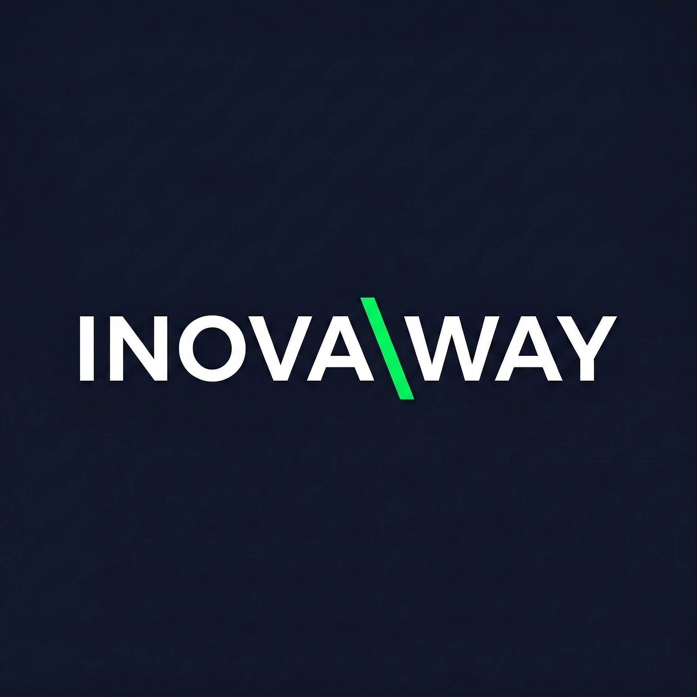
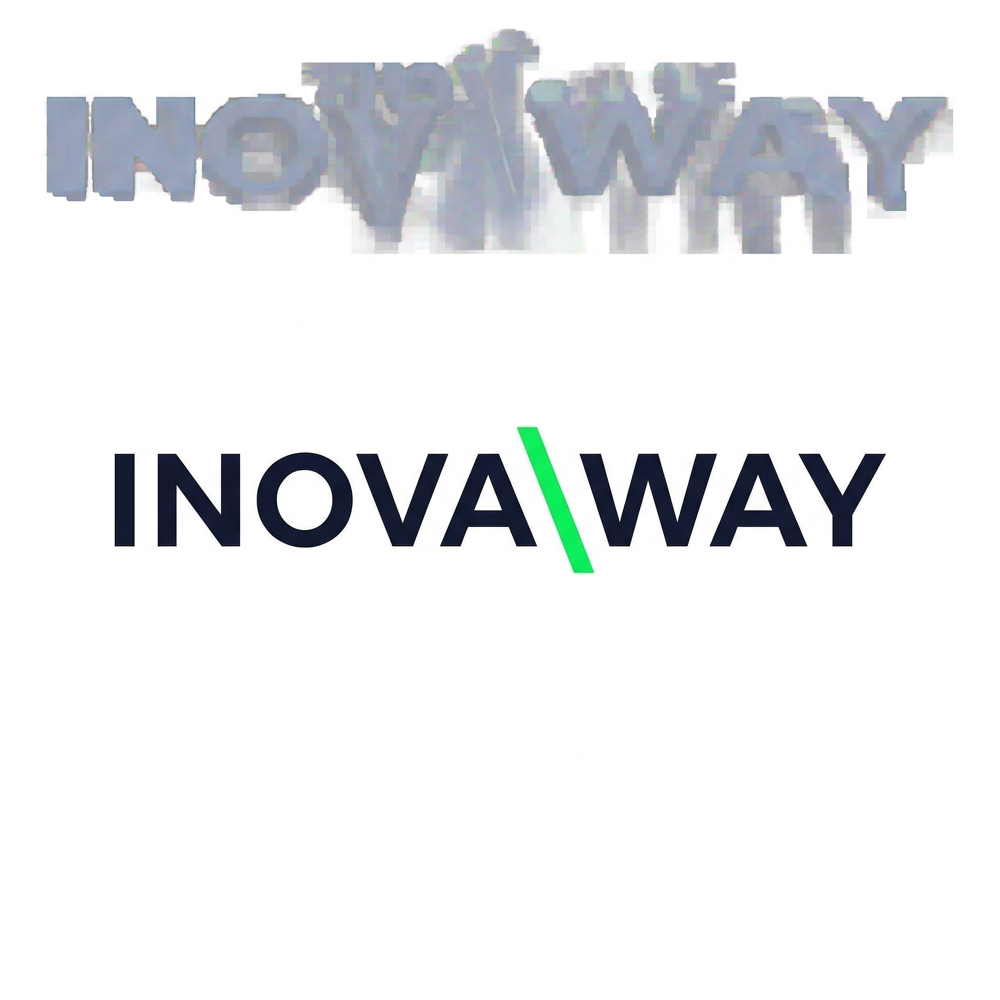
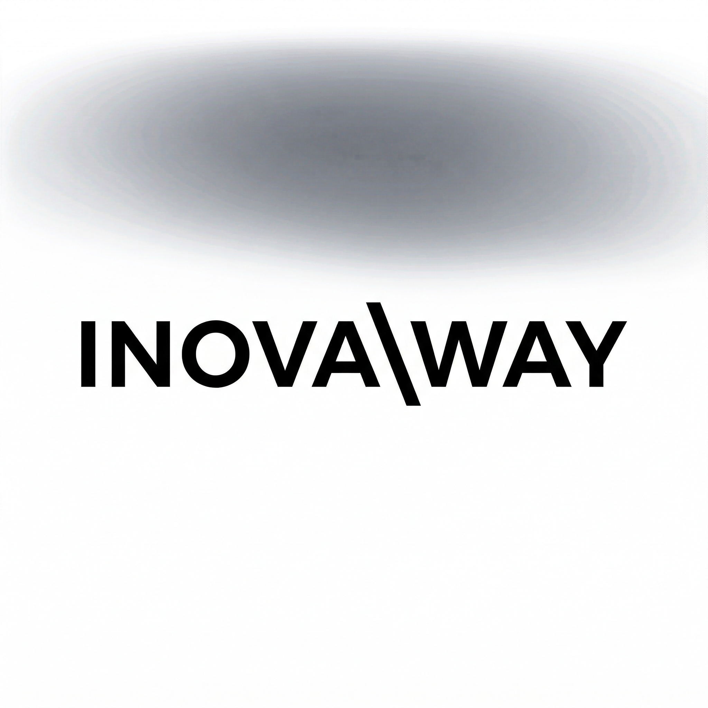
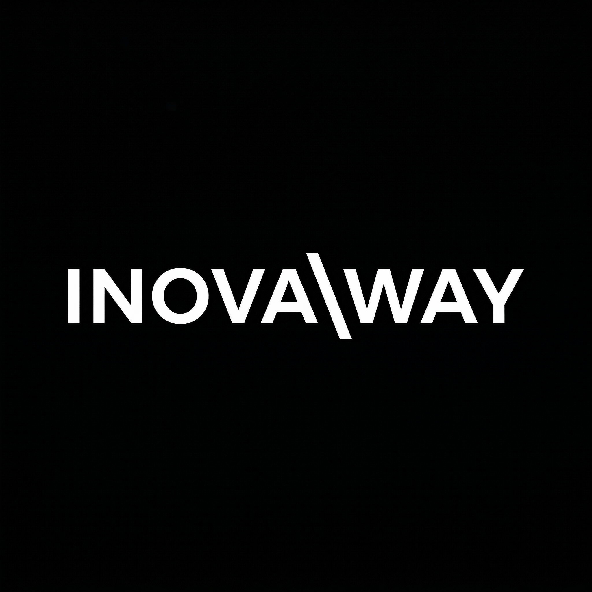

# INOVAWAY — Identidade Visual
**Movimento de Empreendedorismo & Inovação Tecnológica**
> Versão 1.1 · Atualizado em 05/03/2026

---

## 1. Sobre a Marca

**INOVAWAY** é um movimento de empreendedorismo tech — pessoas que surfam na crista da onda das novidades em tecnologia para crescer seus negócios.

| | |
|--|--|
| **Conceito** | Movimento de empreendedorismo com sede de inovação |
| **Público** | Empreendedores tech, fundadores de startups, early adopters |
| **Posicionamento** | Premium · Tech · Futurista · Dark Mode |
| **Referências visuais** | Vercel · Linear · Raycast · Anthropic |

---

## 2. Logotipo

### ✅ Logo Principal Aprovada



**Path:** `docs/logos/inova-backslash-green.png`

**Conceito:**
Wordmark minimalista inspirado na identidade tipográfica da **Anthropic** — logo puro com **um único detalhe especial**: a barra invertida `\` em verde tecnologia. A barra referencia:
- Caminhos de sistema `root\path`
- Direção e movimento — o "WAY", o caminho
- Código, terminal, tecnologia

**Leitura:** `INOVA \ WAY`

**Elementos:**
| Elemento | Cor | Hex |
|----------|-----|-----|
| `INOVA` | Branco puro | `#FFFFFF` |
| `\` | Verde tech | `#00FF41` |
| `WAY` | Branco puro | `#FFFFFF` |
| Fundo | Dark navy | `#0F172A` |

---

## 3. Variações Oficiais

### 3.1 ✅ Original — Dark Mode *(uso principal)*


**Path:** `docs/logos/inova-backslash-green.png`

> **Uso:** site, app, apresentações dark, redes sociais, fundo escuro

---

### 3.2 Fundo Transparente *(PNG alpha — uso universal)*


**Path:** `docs/logos/inovaway-transparent.png`

> **Uso:** overlays, fundos variados, composições, banners, qualquer cor de fundo

---

### 3.3 Fundo Branco


**Path:** `docs/logos/inovaway-white-bg.png`

> **Uso:** documentos impressos, papel timbrado, apresentações light mode, PDF

---

### 3.4 Monocromático Preto


**Path:** `docs/logos/inovaway-mono-black.png`

> **Uso:** carimbos, impressão offset 1 cor, bordado em tecido claro, P&B

---

### 3.5 Monocromático Branco


**Path:** `docs/logos/inovaway-mono-white.png`

> **Uso:** bordado em fundo escuro, gravação laser, sinalização, merch

---

## 4. Mockups de Aplicação

### 4.1 Website — Hero Section


> Hero section dark mode no MacBook — headline, subtexto e CTA verde. Estética Vercel/Linear.

---

### 4.2 Cartão de Visita Premium


> Cards dark navy matte — frente com logo e contato, verso com símbolo `\` centralizado.

---

### 4.3 Merch — Hoodie Premium


> Moletom preto premium — wordmark no peito. Tech startup meets streetwear.

---

## 5. Paleta de Cores

### Cores Primárias

| Amostra | Nome | Hex | Uso |
|---------|------|-----|-----|
| 🟦 | **Dark Navy** | `#0F172A` | Fundo principal |
| ⬜ | **Branco Puro** | `#FFFFFF` | Wordmark, tipografia geral |
| 🟩 | **Verde Tech** | `#00FF41` | Barra `\`, CTAs, destaques |

### Cores Secundárias

| Amostra | Nome | Hex | Uso |
|---------|------|-----|-----|
| 🔵 | **Cyan** | `#06B6D4` | Variação alternativa, gradientes |
| 🟣 | **Purple** | `#8B5CF6` | Gradientes, fundos alternativos |
| ⬛ | **Preto** | `#000000` | Versão mono, impressão |

### Gradiente de Marca *(uso secundário em materiais gráficos)*
```
Cyan #06B6D4 ──────────────→ Purple #8B5CF6
```

---

## 6. Tipografia

### Para o Logotipo
| Elemento | Estilo | Peso | Notas |
|----------|--------|------|-------|
| `INOVA · WAY` | Geometric sans-serif | Regular/Medium | All-caps, wide tracking |
| `\` | Mesmo caractere tipográfico | — | Verde `#00FF41` |

*Famílias de referência: Geist (Vercel), Inter, Söhne, DM Sans*

### Para Comunicação Digital

| Contexto | Família | Peso |
|----------|---------|------|
| Hero / Títulos grandes | Geist ou Inter | Bold / ExtraBold |
| Subtítulos | Inter | Medium |
| Corpo de texto | Inter | Regular |
| Código / Tags técnicas | JetBrains Mono | Regular |
| Botões / Labels | Inter | SemiBold, All-Caps |

---

## 7. Tabela de Aplicações

| Aplicação | Arquivo recomendado | Observação |
|-----------|---------------------|------------|
| **Site / App dark** | `inova-backslash-green.png` | Dark mode preferencial |
| **Site / App light** | `inovaway-white-bg.png` | Conforme tema |
| **Sobre qualquer fundo** | `inovaway-transparent.png` | Versão universal |
| **Cartão de visita** | `inova-backslash-green.png` | Impressão matte premium |
| **Hoodie / Camiseta** | `inovaway-mono-white.png` | Silk ou bordado |
| **Papel timbrado** | `inovaway-white-bg.png` | Topo centralizado |
| **LinkedIn / Twitter avatar** | `inovaway-transparent.png` | Recortar ao `\` |
| **OG Image / Social** | `inova-backslash-green.png` | 1200×630px |
| **Favicon** | `inovaway-transparent.png` | 32×32px, recortar |
| **Apresentações dark** | `inova-backslash-green.png` | Slides tech |
| **Apresentações light** | `inovaway-white-bg.png` | Slides corporativos |
| **Carimbo / 1 cor** | `inovaway-mono-black.png` | Só preto |

---

## 8. Símbolo Isolado `\`

A barra invertida `\` em verde `#00FF41` é o **símbolo standalone** da marca:

```
   \
```

- Funciona como avatar, favicon, ícone de app, marca d'água
- Pode ser usado sozinho quando a marca já está estabelecida no contexto
- Representa: caminho, código, direção, inovação

---

## 9. Usos Corretos e Incorretos

### ✅ Permitido
- Usar qualquer uma das 5 variações oficiais documentadas
- Escalar proporcionalmente mantendo aspect ratio
- Aplicar sobre fundos escuros com leve textura (noise sutil, gradientes sutis)
- Usar o `\` isolado como avatar/ícone após marca estabelecida
- Usar `inovaway-transparent.png` sobre qualquer fundo sólido contrastante

### ❌ Proibido
- Alterar a cor do `\` sem aprovação
- Distorcer proporções
- Colocar logo sobre fundos que comprometam legibilidade
- Reduzir abaixo de **120px de largura** em digital / **3cm** em impresso
- Adicionar sombras, glows ou efeitos extras não previstos
- Substituir a barra invertida por outro símbolo
- Recriar tipograficamente sem usar os arquivos aprovados

---

## 10. Área de Proteção

Espaço mínimo em todos os lados = **altura da letra "I"**

```
╔═══════════════════════════════════╗
║  [margem = altura do I]            ║
║   ┌───────────────────────────┐    ║
║   │   INOVA  \  WAY           │    ║
║   └───────────────────────────┘    ║
║  [margem]                          ║
╚═══════════════════════════════════╝
```

---

## 11. Tom de Voz

| Atributo | Descrição |
|----------|-----------|
| **Personalidade** | Visionário, direto, confiante, técnico sem ser frio |
| **Voz** | Um founder que sabe exatamente para onde está indo |
| **Palavras-chave** | Inovação · Caminho · Tecnologia · Crescimento · Movimento |
| **Evitar** | Jargões vazios, hype sem substância, linguagem corporativa genérica |

**Exemplos de copy:**
- ✅ *"Surfando na crista da inovação."*
- ✅ *"O caminho para o próximo nível começa aqui."*
- ✅ *"Tecnologia que move negócios."*
- ✅ *"Quem innova, abre o caminho."*
- ❌ ~~"Somos uma empresa inovadora focada em soluções disruptivas"~~

---

## 12. Todos os Arquivos

```
docs/logos/
│
│  ── LOGOS ──────────────────────────────────────────────
├── inova-backslash-green.png      ← ✅ LOGO PRINCIPAL APROVADA
├── inovaway-transparent.png       ← PNG fundo transparente (universal)
├── inovaway-white-bg.png          ← Versão fundo branco
├── inovaway-mono-black.png        ← Mono preta (1 cor)
├── inovaway-mono-white.png        ← Mono branca (knockout)
│
│  ── MOCKUPS ────────────────────────────────────────────
├── inovaway-mockup-laptop.png     ← Website hero section
├── inovaway-mockup-card.png       ← Cartão de visita
├── inovaway-mockup-hoodie.png     ← Hoodie / merch
│
│  ── DOCUMENTAÇÃO ───────────────────────────────────────
└── INOVAWAY-BRAND-IDENTITY.md     ← Este documento
```

---

## 13. Registro

| | |
|--|--|
| **Aprovado por** | Eric Milfont |
| **Data de aprovação** | 04/03/2026 |
| **Última atualização** | 05/03/2026 |
| **Creative Director** | Pixel 🎨 |
| **Versão** | 1.1 |

---
*Modificações na identidade visual requerem aprovação prévia do Creative Director.*
