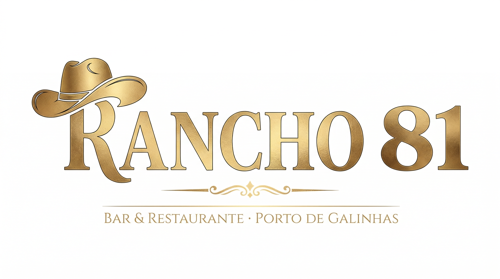
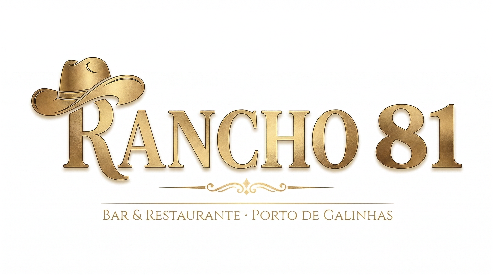
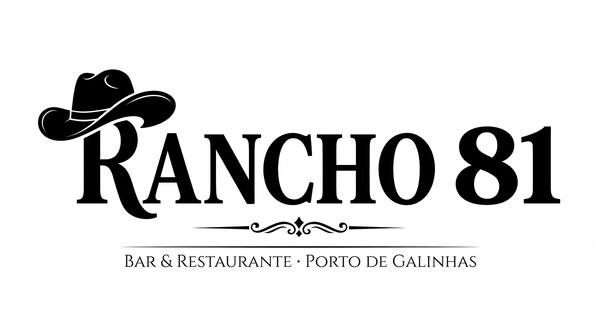
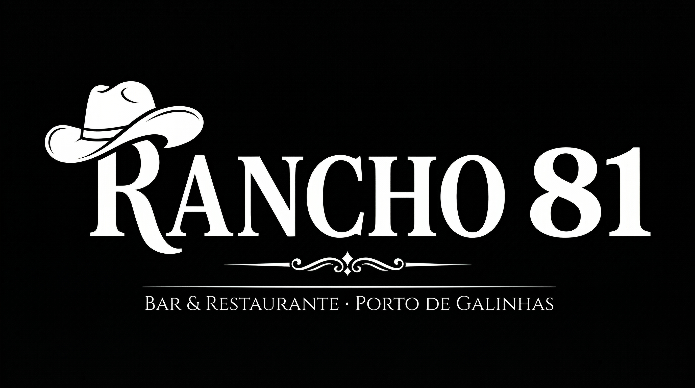

# 🤠 RANCHO81 — Identidade Visual
**Bar & Restaurante Sertanejo · Porto de Galinhas · PE**
> Versão 1.0 · Aprovado em 04/03/2026

---

## 1. Sobre a Marca

O **Rancho81** é um bar e restaurante sertanejo de alta qualidade em Porto de Galinhas, Pernambuco. Une o melhor do universo agro — música ao vivo, cerveja gelada, culinária à la carte — com o charme do principal destino turístico do Nordeste.

| | |
|--|--|
| **Público-alvo** | Turistas do agronegócio (GO, MT, MG) e moradores locais |
| **Serviços** | Café da manhã · Almoço (self service) · Jantar (à la carte) |
| **Diferenciais** | Música ao vivo · Cerveja gelada · Culinária premium |
| **Plataformas** | iFood · Presença física |

---

## 2. Logotipo

### ✅ Logo Principal Aprovada



**Estrutura:**
```
[🎩R]ANCHO  81
───────────────────────
BAR & RESTAURANTE SERTANEJO · PORTO DE GALINHAS · PE
```

**Elementos da logo:**
- 🎩 Chapéu de cowboy integrado na letra **R**
- **RANCHO** em serif/slab-serif bold, dourado metálico
- **81** à direita, mesmo peso tipográfico, dourado metálico
- Linha ornamental separando nome e slogan
- Slogan em serif thin wide-tracked, dourado

---

## 3. Variações Oficiais

### 3.1 Fundo Preto *(uso principal)*

> Uso: placa, outdoor, unifarda, cardápio capa, redes sociais

---

### 3.2 Fundo Branco

> Uso: papel timbrado, embalagens claras, cardápio interno impresso

---

### 3.3 Monocromático Preto *(1 cor)*

> Uso: carimbos, bordado em tecido claro, impressão offset 1 cor, xerox

---

### 3.4 Monocromático Branco *(knockout)*

> Uso: bordado em farda escura, gravação laser, sinalização em metal

---

## 4. Aplicações

### 4.1 Fundo Texturizado Escuro

> Como fica em painel de madeira, cardápio capa de luxo, banner digital

---

### 4.2 Mockup — Placa de Fachada

> Visualização da placa na entrada do restaurante — placa de madeira escura, letras douradas, ambiente tropical Porto de Galinhas

---

## 5. Paleta de Cores

### Cores Primárias

| Amostra | Nome | Hex | Uso |
|---------|------|-----|-----|
| ⬛ | **Preto Rancho** | `#000000` | Fundo principal |
| 🟡 | **Dourado Âmbar** | `#D4A843` | Logotipo, títulos |
| 🌟 | **Dourado Claro** | `#FFD700` | Highlights metálicos |
| 🟤 | **Dourado Escuro** | `#B8860B` | Sombras metálicas |

### Cores Secundárias

| Amostra | Nome | Hex | Uso |
|---------|------|-----|-----|
| 🟫 | **Off-White Creme** | `#F5EED8` | Textos em fundo escuro |
| 🔴 | **Marrom Couro** | `#3D1F0D` | Fundos alternativos quentes |
| 🧱 | **Terracota** | `#8B3A2A` | Elementos de apoio |

### Gradiente Dourado Metálico
```
← #B8860B → #D4A843 → #FFD700 → #D4A843 → #B8860B →
```

---

## 6. Tipografia

### Para o Logotipo
| Elemento | Estilo | Peso |
|----------|--------|------|
| **RANCHO · 81** | Serif/Slab-serif clássica | ExtraBold |
| **Slogan** | Serif thin wide-tracked | Light |

### Para Comunicação

| Contexto | Família | Peso |
|----------|---------|------|
| Títulos de cardápio | Playfair Display | Bold |
| Corpo de texto | Libre Baskerville | Regular |
| Tags / Categorias | Montserrat | SemiBold All-Caps |
| Subtítulos elegantes | Cormorant Garamond | Light Italic |

---

## 7. Tabela de Aplicações

| Aplicação | Versão | Observação |
|-----------|--------|------------|
| **Placa de fachada** | Principal (preta) | Mín. 30cm de largura |
| **Outdoor** | Principal ou Mono branca | Alto contraste |
| **Cardápio capa** | Principal (preta) | Fundo preto + dourado |
| **Cardápio interno** | Fundo branco | Sobre papel creme |
| **Unifarda camiseta** | Mono branca (bordado/silk) | Tecido escuro |
| **Boné** | Ícone isolado (chapéu+R) | Bordado frontal |
| **Porta-copo** | Mono circular | Adaptar para redondo |
| **iFood avatar** | Ícone isolado 512×512 | |
| **Instagram profile** | Ícone isolado | Fundo preto |
| **Papel timbrado** | Fundo branco | Topo centralizado |

---

## 8. Usos Corretos e Incorretos

### ✅ Permitido
- Usar nos 4 variações oficiais documentadas
- Escalar proporcionalmente mantendo aspect ratio
- Aplicar sobre fundos escuros texturizados (madeira, couro)

### ❌ Proibido
- Distorcer ou esticar a proporção
- Usar cores fora da paleta oficial
- Aplicar sobre fundos com muito ruído visual
- Reduzir abaixo de **3cm de largura**
- Logo dourada sobre fundo amarelo/bege claro
- Remover o chapéu ou qualquer elemento
- Modificar a tipografia

---

## 9. Área de Proteção

Área mínima de proteção = **altura da letra "R"** em todos os lados.

```
╔═══════════════════════════════════╗
║  [margem = altura R]              ║
║   ┌───────────────────────────┐   ║
║   │  [🎩R]ANCHO  81          │   ║
║   │  ───────────────────────  │   ║
║   │  BAR & RESTAURANTE · PDG  │   ║
║   └───────────────────────────┘   ║
║  [margem]                         ║
╚═══════════════════════════════════╝
```

---

## 10. Tom de Voz

| Atributo | Descrição |
|----------|-----------|
| **Personalidade** | Acolhedor, orgulhoso, premium sem arrogância |
| **Voz** | Dono de fazenda bem-sucedido recebendo convidados |
| **Palavras-chave** | Autêntico · Tradição · Qualidade · Sertanejo · Porto de Galinhas |

**Exemplos:**
- ✅ *"Bem-vindo ao Rancho. Aqui, cada refeição é uma celebração."*
- ✅ *"Do sertão ao mar. A culinária que o Brasil tem orgulho."*
- ✅ *"Cerveja gelada, música ao vivo, mesa farta."*
- ❌ ~~"O melhor do agro em PDG!!!"~~

---

## 11. Arquivos

```
docs/logos/
├── rancho81-v2-horizontal.png        ← LOGO PRINCIPAL ✅ APROVADA
├── rancho81-brand-white-bg.png       ← Fundo branco
├── rancho81-brand-mono-black.png     ← Mono preta
├── rancho81-brand-mono-white.png     ← Mono branca
├── rancho81-dark-texture.png         ← Aplicação fundo texturizado
├── rancho81-mockup-placa.png         ← Mockup placa de fachada
└── RANCHO81-BRAND-IDENTITY.md        ← Este documento
```

---

## 12. Registro

| | |
|--|--|
| **Aprovado por** | Eric Milfont |
| **Data** | 04/03/2026 |
| **Creative Director** | Pixel 🎨 |
| **Versão** | 1.0 |

---
*Modificações na identidade visual requerem aprovação prévia.*
